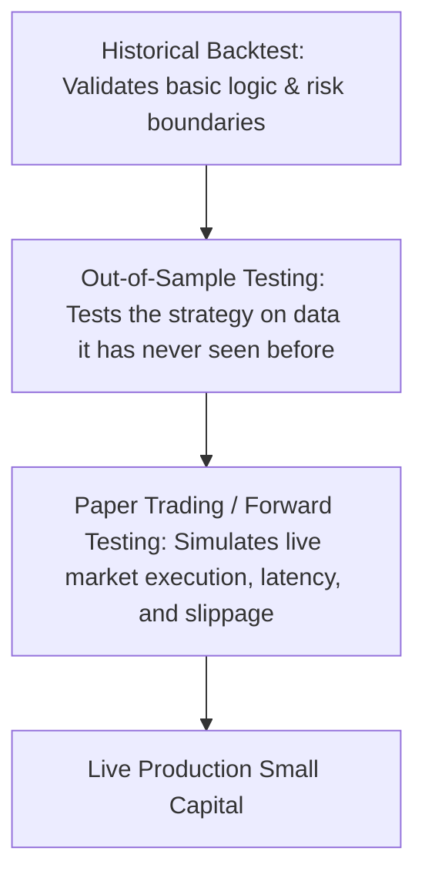

# Backtesting
-  Why backtest? Past performance is not an indicator of future performance
>A failing backtest almost guarantees a failing future. If your strategy cannot even make money in a historical environment perfectly suited for it, it has zero chance of surviving live markets. It saves you from risking real capital on fundamentally flawed logic.
> 
> Markets change, but human psychology and structural mechanics do not. Even if the exact sequence of prices never repeats, the statistical characteristics of market panics, liquidations, and trends do.

## Backtesting -> Real investing pipeline

